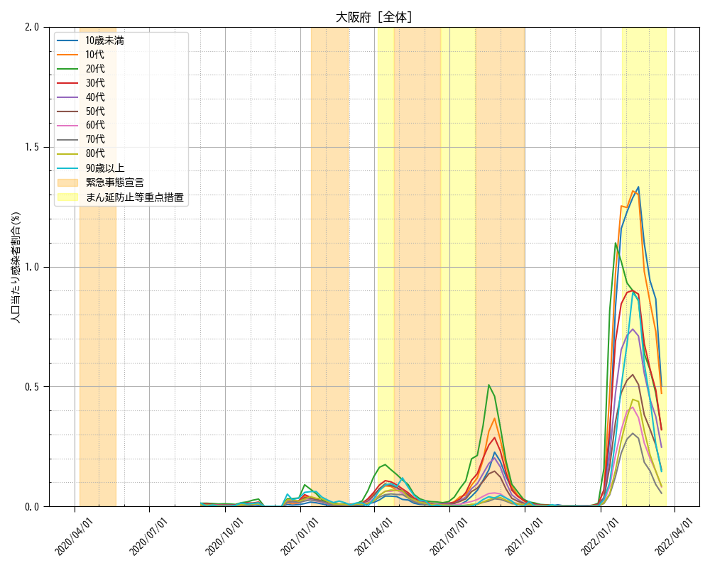
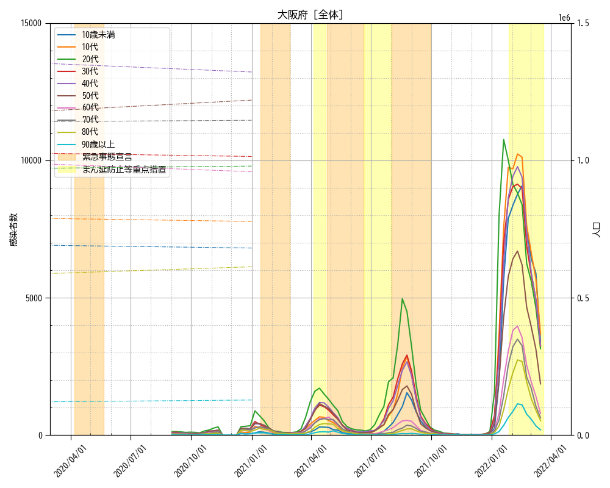

# graph-infected
人口情報と新型コロナ感染者数情報から、都道府県別でグラフを作成するスクリプトです。

- output
  - 出力形式: 数値データ(CSV), グラフ(PNG)
  - 出力内容: 「人口当たりの感染者数割合」,「人口、感染者数」
  - 集約単位: 都道府県別、性別(男、女、合計)

## データ準備
### 人口データ
- 全国の都道府県別の年次人口 https://www.e-stat.go.jp/stat-search/files?page=1&layout=datalist&toukei=00200241&tstat=000001039591&cycle=7&tclass1=000001039601&tclass2val=0
  - 「【総計】都道府県別年齢階級別人口」のエクセルファイルを`input/stnen`フォルダに格納 ※年次

### 感染者数データ 
- 厚生労働省 感染者動向 https://covid19.mhlw.go.jp/extensions/public/index.html
  - 「性別・年代別新規陽性者数（週別）」のオープンデータを`input`フォルダに格納 ※週次

## 実行手順
人口データ、感染者数データを読み込んで、CSV、グラフを出力する
```
python ./src/main.py
``` 

### 注意
- 人口データ
  - エクセルから毎回取得しなおすのは大変なので、中間ファイルがないときだけエクセルから中間ファイルを生成する
  - 新しい人口データファイルを追加したら、中間ファイルを削除する
  - 中間ファイル `./input/stnen.csv`

## 出力例
### グラフ
- 大阪府全体の人口当たりの感染者割合

- 大阪府全体の人口、感染者数

